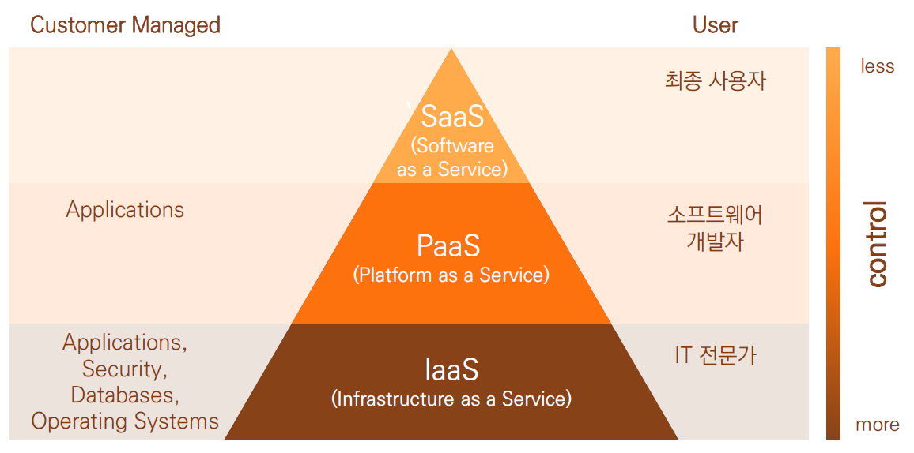
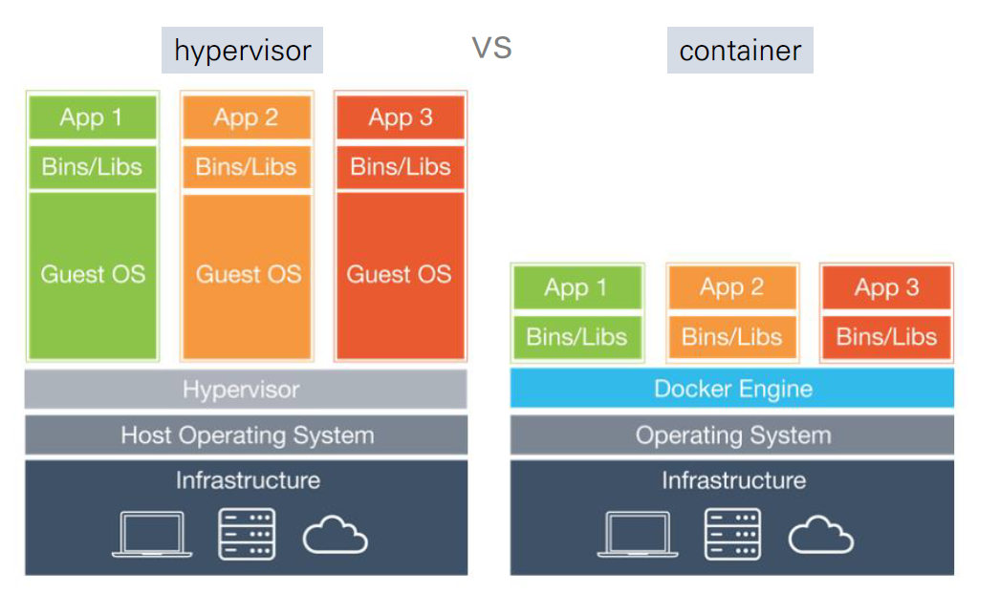

# 클라우드 모델 및 특징

## 클라우드 모델 개요

## IaaS
- `Infrastructure as a Service`
- 사용자 : IT 전문가가 활용
- 유형 : 어플리케이션, OS, 보안, 데이터베이스 
- ❗ CPU나 하드웨어 등의 컴퓨팅 리소스(자원)를 네트워크를 통해 서비스로 제공하는 모델
- 전통적으로 물리(하드웨어 자원) -> OS -> 응용프로그램 순이었던 아키텍처를 가상화를 통해 변경
- 물리 -> 가상화 레이어 -> 여러개의 OS와 여러개의 응용 프로그램이 돌아갈 수 있도록 해줌
- **물리적 리소스**를 **가상화** 하여 유연한 Infrastructure을 제공
- 최근 클라우드가 유행하게 된 것에는 Hypervisor(구 시대)과 **Container**(현재)의 차이에 이유가 있다. 가상화 유형이 변화하면서 클라우드의 유행을 선도

- Docker(Container방식의 도구 중 하나)로 관리하면서 위에 따로 게스트 OS를 올릴 필요가 없어짐.
- 자세한 내용을 제 [블로그]()애서 확인하세용.

## PaaS
- `Platform as a Service`
- 기업의 애플리케이션 실행 환경 및 애플리케이션 **개발 환경**을 서비스로써 제공하는 모델
- Cloud Foundry : 어플리케이션의 배포 및 운영을 간소화 하기 위한 PaaS Platform

## SaaS
- `Software as a Service`
- 주로 업무에서 사용하는 소프트웨어의
기능을 인터넷 등의 네트워크를 통해 필요한 만큼 서비스로 이용할 수 있도록 제공하는 형태
- 성숙된 SaaS 는 Multi Tenant, Configuration, Scalability 충족
- SaaS 기술적 특징
  - 환경 설정(Configuration)
    - 소스코드 레벨의 수정 없이 사용자의 요구사항을 수용
      - 사용자가 필요한 기능은 설정을 통해 사용할 수 있음
  - 다중 사용자 지원(Multi-Tenancy)
    - 하나의 어플리케이션을 다수의 사용자(Tenant)가 공유하여 사용하는 다중 소유 아키텍처 지원
  - 확장성(Scalability)
    - 가용성 및 성능 지원을 위해 다수의 인스턴스를 생성하고 사용자의 데이터를 분산 관리하며, 가상화 · 분산병렬 처리 등을 통해 확장성 있는 서비스를 제공