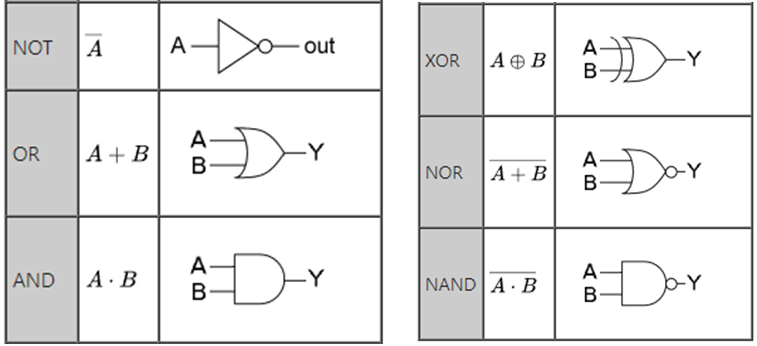

# 논리 회로 기본

## 논리 회로 정의
 * 한자: 論理 回路 
 * 영어: logic circuit

## 논리 게이트

| 게이트 종류 | 입력 | 입력 |
|:--:|--|--|
| 입력 | 출력 | 출력 |
| 입력 | 출력 | 출력 |

* 논리 게이트

| AND | 0 | 1 |
|:--:|--|--|
| 0 | 0 | 0 |
| 1 | 0 | 1 |
`AND 게이트`는 입력이 모두 1이어야 출력도 1이 나온다. 입력이 3개 이상일 수 있다.

| OR  | 0 | 1 |
|:--:|--|--|
| 0 | 0 | 1 |
| 1 | 1 | 1 |
`OR 게이트`는 입력 중 하나만 1이어도 출력이 1이다.

| 입력 | 출력 |
|:--:|:--:|
| 0 | 1 |
| 1 | 0 |
`NOT 게이트`는 입력이 1이면 0을 출력하고, 입력이 0이면 1을 출력한다. `보수기`라고 불리기도 한다.

| NAND | 0 | 1 |
|:--:|--|--|
| 0 | 1 | 1 |
| 1 | 1 | 0 |
`NAND 게이트`는 AND 게이트 뒤에 NOT 게이트를 붙여, 출력이 1이면 0으로, 출력이 0이면 1로 만들어준다.

| NOR | 0 | 1 |
|:--:|--|--|
| 0 | 1 | 0 |
| 1 | 0 | 0 |
`NOR 게이트`는 OR 게이트 뒤에 NOT 게이트를 붙여, 출력이 1이면 0으로, 출력이 0이면 1로 만들어준다.

| XOR | 0 | 1 |
|:--:|--|--|
| 0 | 0 | 1 |
| 1 | 1 || 0 |
`XOR 게이트`는 exclusive OR 게이트의 줄임말로 한국어로는 **상호 배제**적인 OR 게이트이다. 상호 배제적 OR 게이트란 이름의 의미는 OR 게이트와 동일하게 작동하지만 입력값이 동일한 경우에는 1을 출력하지 않는다는 의미이다. 

>입력값이 서로 다르면 1을 출력하고, 같으면 0을 출력한다.

| XNOR | 0 | 1 |
|:--:|--|--|
| 0 | 1 | 0 |
| 1 | 0 | 1 |
`XNOR 게이트`(XNOR gate 또는 EXNOR, ENOR, NXOR, XAND gate)는 XOR 게이트 뒤에 NOT 게이트를 붙여 출력값을 반대로 만들어놓은 것이다. 
> 입력값이 서로 같으면 1을 출력하고, 다르면 0을 출력한다. 그래서 비교 게이트나 일치 확인 게이트라고도 불린다.

## 논리 게이트 이미지

