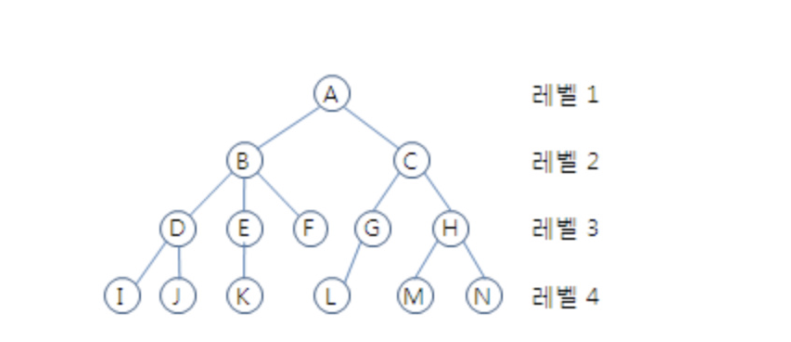

# Tree(트리 구조)

## 트리란?
- 계층적인 구조를 표현
    - 조직도
    - 디렉토리와 서브디렉토리 구조
    - 가계도
- 트리는 노드(node)들과 노드들을 연결하는 링크(link)들로 구성됨
- 
## 용어
    루트 노드(root node) : 부모가 없는 노드. 트리는 하나의 루트 노드만을 가진다.
    단말 노드(leaf node) : 자식이 없는 노드이다.
    내부(internal) 노드 : 리프 노드가 아닌 노드.
    링크(link) : 노드를 연결하는 선 (edge, branch 라고도 부름).
    형제(sibling) : 같은 부모를 가지는 노드.

- 노드의 크기(size) : **자신을 포함**한 모든 자손 노드의 개수.
    - C의 크기 : 6
- 노드의 깊이(depth) : 루트에서 어떤 노드에 도달하기 위해 **거쳐야 하는 간선의 수**
    - D의 깊이 : 2
    - L의 깊이 : 3
- 노드의 레벨(level) : 트리의 특정 깊이를 가지는 노드의 집합
    - A의 레벨 : 1
    - B, C의 레벨 : 2
    - D, E, F, G, H의 레벨 : 3
- 노드의 차수(degree) : 부(하위) 트리 갯수/간선수 (degree) = 각 노드가 지닌 가지의 수
    - A의 차수 = 2
    - B의 차수 = 3
    - C의 차수 = 2
- 트리의 차수(degree of tree) : 트리의 최대 차수
    - B가 최대 차수를 가짐 => 3
- 트리의 높이(height) : 루트 노드에서 가장 깊숙히 있는 노드의 **깊이**
    - 3
    - 높이는 사람마다 책마다 정의가 좀 다른 것 같다. 각 노드 층의 개수를 세서 높이라고 하는 경우가 많은 거 같다.
      -  위의 그림의 경우 이와 같다면 높이는 4이다.
      -  이 정의로 **포화 이진 트리의 노드 수**를 구하곤 한다.

## 트리의 기본적인 성질
- 노드가 N개인 트리는 항상 N-1개의 링크(link)를 가진다
- 트리에서, 루트에서 어떤 노드로 가는 경로는 유일하다. 또한 임의의 두 노드 간의 경로도 유일하다 (같은 노드를 두 번 이상 방문하지 않는 다는 조건 하에)

# 이진트리(Binary Tree)

## 이진 트리란?
- 이진 트리에서 각 노드는 최대 2개의 자식을 가진다.
- 각각의 자식 노드는 자신이 부모의 왼쪽 자식인지 오른쪽 자식인지가 지정된다.
- 자식이 한 명인 경우에도 적용

## 이진 트리 종류
- 포화 이진 트리(full binary tree) : 모든 레벨에서 노드들이 모두 채워져 있는 트리
- 완전 이진트리(complete binary tree)
    - 마지막 레벨을 제외하고 노드가 모두 채워져 있는 트리
    - 마지막 레벨도 다 채워져 있을 수도 있음(= 포화이진트리)
    - 마지막 레벨도 오른쪽으로 연속된 몇개의 노드만 비어있을 수 있음(왼쪽 부터 채움)

## 이진트리 특징
- 높이가 h인 포화 이진 트리(full binary tree)는 `2^h−1`개의 노드를 가진다
  - 여기서 h는 각 노드의 층을 센 높이를 말한다.
- 노드가 N개인 포화(full) 혹은 완전(complete) 이진 트리의 높이는 `O(logN)`이다.
- 노드가 N개인 이진트리의 높이는 최악의 경우 `O(N)`이 될 수 있다.