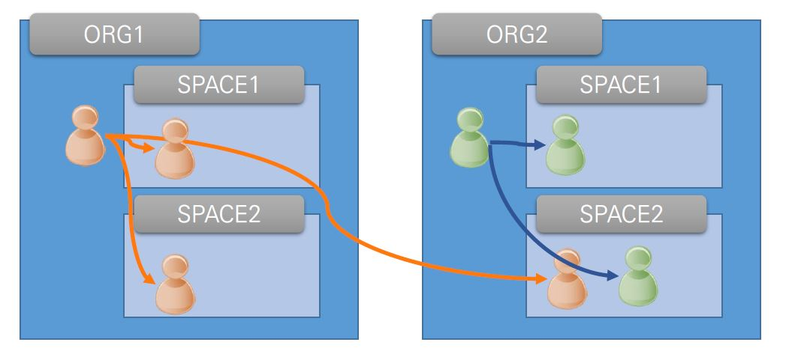

# Org & Space
> 효과적으로
업무를 구분할 수 있는 논리적인 그룹 기능

- 결국 ORG는 사람(그러나 한명을 말하는 것 일 수도, 여러 사람을 하나로 명칭하는 것 일 수도 있다.), SPACE는 부서라고 생각하면 조금 쉬울 것 같다.
- 여러 부서(SPACE)에서 한 사람(ORG)가 각각 일을 할 수 있다고 비유해 보면 어떨까.

## ORG
- 개인 또는 여러 공동 작업자가 소유하고 사용할 수 있는 개발 계정
- 각 계정은 ORG 에 롤을 부여 받을
수 있음
- ORG는 여러 일을 할 수 있다
  - 즉, 여러 SPACE에서 일을 할 수 있다는 뜼

## SPACE
- 모든 애플리케이션 및 서비스의
범위가 공간으로 지정
- 한 SPACE에서는 여러 ORG들이 들어가 일을 한다.